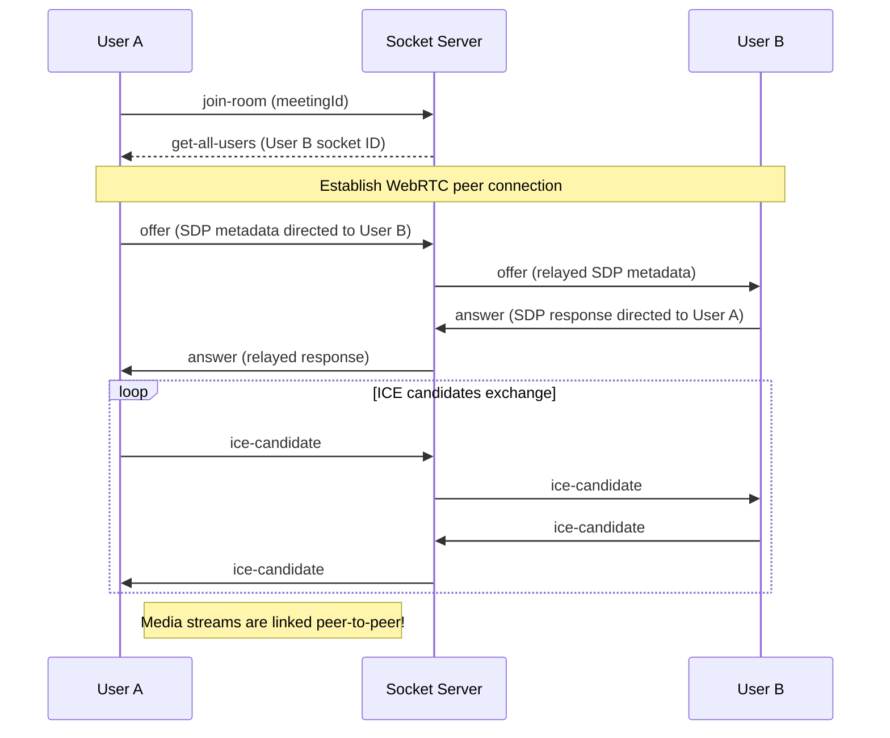

# IntellMeet 🎥🤖
### AI-Powered Meeting & Collaboration Platform

IntellMeet is a modern, full-stack MERN application designed for seamless video conferencing, real-time workspace messaging, team collaboration, and AI-driven summary/action-item logs.

---

## 🚀 Key Features

1. **User Authentication**: Secure register, login, and profile lookup using JWT and bcrypt password encryption.
2. **Interactive Dashboard**: Quickly launch meetings, join using custom codes (e.g. `abc-defg-hij`), and inspect history logs.
3. **WebRTC Video Conference**: Multi-party WebRTC mesh grid calling supporting real-time video/audio toggles and local screen sharing.
4. **Real-Time Workspace Chat**: Real-time room messaging with typing indicators and timestamps powered by Socket.io.
5. **AI Assistant**: Auto-generates meeting summaries and action checklists by processing message transcripts using OpenAI GPT-3.5 (with a local rule-based mock backup system if no API key is set).
6. **Workspace Workspaces**: Create teams, invite collaborators by email, and edit a live synchronized shared markdown document.
7. **Premium Responsive UI**: Beautiful glassmorphic dark-mode design built with Tailwind CSS v4, transitions, and loading feedback.

---

## 📂 Project Architecture

```
Root/
├── package.json (root orchestration)
├── server/
│   ├── server.js (entry point)
│   ├── config/ (MongoDB configuration)
│   ├── controllers/ (Auth, Meeting, Team, AI logic)
│   ├── middleware/ (JWT Auth, Error interceptors)
│   ├── models/ (User, Meeting, Message, Team, Summary schemas)
│   ├── routes/ (Express routes mapping)
│   ├── socket/ (WebRTC signaling & Chat live broadcasting)
│   └── utils/ (OpenAI integration & local fallbacks)
└── client/
    ├── vite.config.js (Proxy configuration & plugins)
    ├── src/
    │   ├── main.jsx (React render bootstrap)
    │   ├── App.jsx (Routes & private guard setup)
    │   ├── index.css (Tailwind CSS v4 setup & custom styles)
    │   ├── components/ (Navbar, Toast overlays)
    │   ├── context/ (Auth, Theme, Toast providers)
    │   ├── hooks/ (useSocket connections, useWebRTC signaling)
    │   ├── pages/ (Login, Register, Dashboard, MeetingRoom, Teams, Profile)
    │   └── services/ (Fetch API requests, AI operations)
```

---

## 🛠️ Local Setup Instructions

### Prerequisites
- [Node.js](https://nodejs.org/) (v16.0.0 or higher recommended)
- [MongoDB](https://www.mongodb.com/try/download/community) installed locally or a [MongoDB Atlas](https://www.mongodb.com/cloud/atlas) account.

### Step-by-Step Installation

1. **Clone/Download the repository** to your local workspace directory.

2. **Backend Server Configuration**:
   - Navigate to `server/` directory and check the `.env` configuration file:
     ```env
     PORT=5000
     NODE_ENV=development
     MONGO_URI=mongodb://127.0.0.1:27017/intellmeet
     JWT_SECRET=intellmeetsecretkey
     OPENAI_API_KEY=YOUR_OPENAI_API_KEY
     ```
   - *Note*: If `OPENAI_API_KEY` is omitted or left as default, the backend will automatically fall back to our local rule-based AI meeting summary assistant.

3. **Install Dependencies**:
   - In the **root directory**, simply execute:
     ```bash
     npm install
     ```
     This will install the orchestrator packages.
   - Run the automatic installer script to configure both client and server packages:
     ```bash
     npm run install-all
     ```

4. **Launch the Development Servers**:
   - Start the concurrent servers with:
     ```bash
     npm run dev
     ```
   - This single command boots up the Express API server on `http://localhost:5000` and the Vite React app on `http://localhost:3000` concurrently with auto-proxy capabilities.

---

## 🔌 Socket.io & WebRTC Signaling Workflow

The WebRTC multi-party video conferencing is implemented using a **mesh topology** coordinated by Socket.io:



---

## 🤖 AI Summary Assistant Module

The AI helper parses meeting conversations (chat logs) to generate summaries and actionable checklist items:

- **OpenAI Model**: `gpt-3.5-turbo` using `response_format: { type: 'json_object' }` to return clean JSON fields containing `summary` and `actionItems`.
- **API Fallback**: If no OpenAI API Key is provided, a parser compiles user chat logs, searches for actionable terms (`todo`, `need to`, `please`, `will do`), and logs a mock summary so testing remains possible.

---

## 🌐 Production Deployment Guide

### Backend Server (Render / Heroku)
1. Register/Login to [Render](https://render.com/).
2. Create a new **Web Service** and link your Git repository.
3. Configure the following **Environment Variables**:
   - `NODE_ENV=production`
   - `MONGO_URI=your_mongodb_atlas_connection_string`
   - `JWT_SECRET=your_production_jwt_signing_key`
   - `OPENAI_API_KEY=your_openai_api_key`
4. Set the **Build Command** to: `npm install` (inside the `server` directory).
5. Set the **Start Command** to: `node server.js`.

### Frontend Client (Vercel / Netlify)
1. Register/Login to [Vercel](https://vercel.com/).
2. Click **Add New Project** and select your repository.
3. Set the **Framework Preset** to **Vite**.
4. Set the **Root Directory** to `client`.
5. Set the **Build Command** to: `npm run build`.
6. Set the **Output Directory** to: `dist`.
7. deploy! The client proxy will automatically align requests to your backend endpoints.
